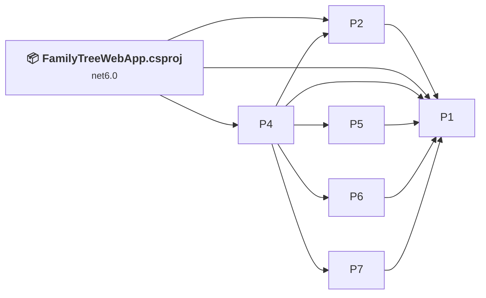
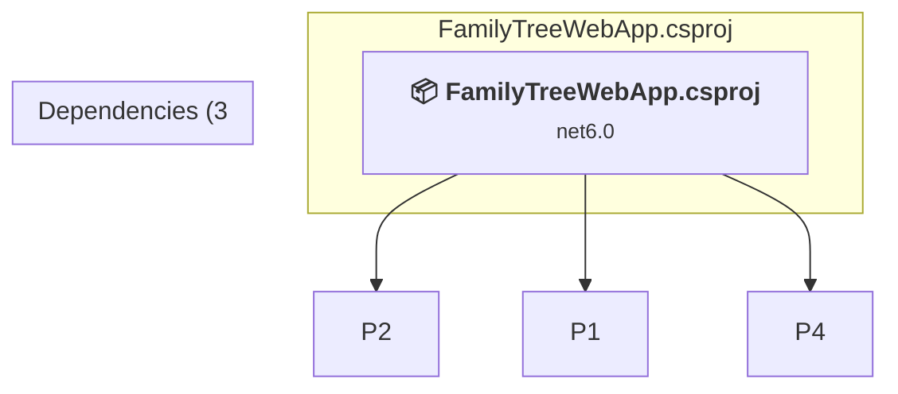

# Projects and dependencies analysis

This document provides a comprehensive overview of the projects and their dependencies in the context of upgrading to .NETCoreApp,Version=v10.0.

## Table of Contents

- [Executive Summary](#executive-Summary)
  - [Highlevel Metrics](#highlevel-metrics)
  - [Projects Compatibility](#projects-compatibility)
  - [Package Compatibility](#package-compatibility)
  - [API Compatibility](#api-compatibility)
- [Aggregate NuGet packages details](#aggregate-nuget-packages-details)
- [Top API Migration Challenges](#top-api-migration-challenges)
  - [Technologies and Features](#technologies-and-features)
  - [Most Frequent API Issues](#most-frequent-api-issues)
- [Projects Relationship Graph](#projects-relationship-graph)
- [Project Details](#project-details)

  - [%USERPROFILE%\OneDrive\Visual Studio\Projects\ImproveYourTree\FamilyTreeCodecGedcom\FamilyTreeCodecGedcom.csproj](#%userprofile%onedrivevisual-studioprojectsimproveyourtreefamilytreecodecgedcomfamilytreecodecgedcomcsproj)
  - [%USERPROFILE%\OneDrive\Visual Studio\Projects\ImproveYourTree\FamilyTreeCodecGeni\FamilyTreeCodecGeni.csproj](#%userprofile%onedrivevisual-studioprojectsimproveyourtreefamilytreecodecgenifamilytreecodecgenicsproj)
  - [%USERPROFILE%\OneDrive\Visual Studio\Projects\ImproveYourTree\FamilyTreeCodecText\FamilyTreeCodecText.csproj](#%userprofile%onedrivevisual-studioprojectsimproveyourtreefamilytreecodectextfamilytreecodectextcsproj)
  - [%USERPROFILE%\OneDrive\Visual Studio\Projects\ImproveYourTree\FamilyTreeLibrary\FamilyTreeLibrary.csproj](#%userprofile%onedrivevisual-studioprojectsimproveyourtreefamilytreelibraryfamilytreelibrarycsproj)
  - [%USERPROFILE%\OneDrive\Visual Studio\Projects\ImproveYourTree\FamilyTreeTools\FamilyTreeTools.csproj](#%userprofile%onedrivevisual-studioprojectsimproveyourtreefamilytreetoolsfamilytreetoolscsproj)
  - [%USERPROFILE%\OneDrive\Visual Studio\Projects\ImproveYourTree\FamilyTreeWebTools\FamilyTreeWebTools.csproj](#%userprofile%onedrivevisual-studioprojectsimproveyourtreefamilytreewebtoolsfamilytreewebtoolscsproj)
  - [FamilyTreeWebApp.csproj](#familytreewebappcsproj)

## Executive Summary

### Highlevel Metrics

| Metric | Count | Status |
| :--- | :---: | :--- |
| Total Projects | 7 | All require upgrade |
| Total NuGet Packages | 12 | 7 need upgrade |
| Total Code Files | 219 |  |
| Total Code Files with Incidents | 7 |  |
| Total Lines of Code | 34242 |  |
| Total Number of Issues | 14 |  |
| Estimated LOC to modify | 0+ | at least 0,0% of codebase |

### Projects Compatibility

| Project | Target Framework | Difficulty | Package Issues | API Issues | Est. LOC Impact | Description |
| :--- | :---: | :---: | :---: | :---: | :---: | :--- |
| [%USERPROFILE%\OneDrive\Visual Studio\Projects\ImproveYourTree\FamilyTreeCodecGedcom\FamilyTreeCodecGedcom.csproj](#%userprofile%onedrivevisual-studioprojectsimproveyourtreefamilytreecodecgedcomfamilytreecodecgedcomcsproj) | net6.0 | 🟢 Low | 0 | 0 |  | ClassLibrary, Sdk Style = True |
| [%USERPROFILE%\OneDrive\Visual Studio\Projects\ImproveYourTree\FamilyTreeCodecGeni\FamilyTreeCodecGeni.csproj](#%userprofile%onedrivevisual-studioprojectsimproveyourtreefamilytreecodecgenifamilytreecodecgenicsproj) | net6.0 | 🟢 Low | 0 | 0 |  | ClassLibrary, Sdk Style = True |
| [%USERPROFILE%\OneDrive\Visual Studio\Projects\ImproveYourTree\FamilyTreeCodecText\FamilyTreeCodecText.csproj](#%userprofile%onedrivevisual-studioprojectsimproveyourtreefamilytreecodectextfamilytreecodectextcsproj) | net7.0 | 🟢 Low | 0 | 0 |  | ClassLibrary, Sdk Style = True |
| [%USERPROFILE%\OneDrive\Visual Studio\Projects\ImproveYourTree\FamilyTreeLibrary\FamilyTreeLibrary.csproj](#%userprofile%onedrivevisual-studioprojectsimproveyourtreefamilytreelibraryfamilytreelibrarycsproj) | net7.0 | 🟢 Low | 0 | 0 |  | ClassLibrary, Sdk Style = True |
| [%USERPROFILE%\OneDrive\Visual Studio\Projects\ImproveYourTree\FamilyTreeTools\FamilyTreeTools.csproj](#%userprofile%onedrivevisual-studioprojectsimproveyourtreefamilytreetoolsfamilytreetoolscsproj) | net7.0 | 🟢 Low | 0 | 0 |  | ClassLibrary, Sdk Style = True |
| [%USERPROFILE%\OneDrive\Visual Studio\Projects\ImproveYourTree\FamilyTreeWebTools\FamilyTreeWebTools.csproj](#%userprofile%onedrivevisual-studioprojectsimproveyourtreefamilytreewebtoolsfamilytreewebtoolscsproj) | net6.0 | 🟢 Low | 0 | 0 |  | ClassLibrary, Sdk Style = True |
| [FamilyTreeWebApp.csproj](#familytreewebappcsproj) | net6.0 | 🟢 Low | 7 | 0 |  | AspNetCore, Sdk Style = True |

### Package Compatibility

| Status | Count | Percentage |
| :--- | :---: | :---: |
| ✅ Compatible | 5 | 41,7% |
| ⚠️ Incompatible | 0 | 0,0% |
| 🔄 Upgrade Recommended | 7 | 58,3% |
| ***Total NuGet Packages*** | ***12*** | ***100%*** |

### API Compatibility

| Category | Count | Impact |
| :--- | :---: | :--- |
| 🔴 Binary Incompatible | 0 | High - Require code changes |
| 🟡 Source Incompatible | 0 | Medium - Needs re-compilation and potential conflicting API error fixing |
| 🔵 Behavioral change | 0 | Low - Behavioral changes that may require testing at runtime |
| ✅ Compatible | 30223 |  |
| ***Total APIs Analyzed*** | ***30223*** |  |

## Aggregate NuGet packages details

| Package | Current Version | Suggested Version | Projects | Description |
| :--- | :---: | :---: | :--- | :--- |
| Ekmansoft.FamilyTree.Library | 1.3.0 |  | [FamilyTreeWebApp.csproj](#familytreewebappcsproj) | ✅Compatible |
| Ekmansoft.FamilyTree.Tools | 1.3.0 |  | [FamilyTreeWebApp.csproj](#familytreewebappcsproj) | ✅Compatible |
| Ekmansoft.FamilyTree.WebTools | 1.3.1 |  | [FamilyTreeWebApp.csproj](#familytreewebappcsproj) | ✅Compatible |
| Microsoft.AspNetCore.DataProtection | 6.0.0 | 10.0.5 | [FamilyTreeWebApp.csproj](#familytreewebappcsproj) | NuGet package upgrade is recommended |
| Microsoft.AspNetCore.Identity.EntityFrameworkCore | 6.0.0 | 10.0.5 | [FamilyTreeWebApp.csproj](#familytreewebappcsproj) | NuGet package upgrade is recommended |
| Microsoft.AspNetCore.Identity.UI | 6.0.0 | 10.0.5 | [FamilyTreeWebApp.csproj](#familytreewebappcsproj) | NuGet package upgrade is recommended |
| Microsoft.EntityFrameworkCore.SqlServer | 6.0.0 | 10.0.5 | [FamilyTreeWebApp.csproj](#familytreewebappcsproj) | NuGet package upgrade is recommended |
| Microsoft.EntityFrameworkCore.Tools | 6.0.0 | 10.0.5 | [FamilyTreeWebApp.csproj](#familytreewebappcsproj) | NuGet package upgrade is recommended |
| Microsoft.Extensions.Logging.Debug | 6.0.0 | 10.0.5 | [FamilyTreeWebApp.csproj](#familytreewebappcsproj) | NuGet package upgrade is recommended |
| Microsoft.VisualStudio.Web.CodeGeneration.Design | 6.0.0 | 10.0.2 | [FamilyTreeWebApp.csproj](#familytreewebappcsproj) | NuGet package upgrade is recommended |
| Pomelo.EntityFrameworkCore.MySql | 6.0.0 |  | [FamilyTreeWebApp.csproj](#familytreewebappcsproj) | ✅Compatible |
| SharpKml.Core | 5.1.0 |  | [FamilyTreeWebApp.csproj](#familytreewebappcsproj) | ✅Compatible |

## Top API Migration Challenges

### Technologies and Features

| Technology | Issues | Percentage | Migration Path |
| :--- | :---: | :---: | :--- |

### Most Frequent API Issues

| API | Count | Percentage | Category |
| :--- | :---: | :---: | :--- |

## Projects Relationship Graph

Legend:
📦 SDK-style project
⚙️ Classic project

## Project Details

### FamilyTreeWebApp.csproj

#### Project Info

- **Current Target Framework:** net6.0
- **Proposed Target Framework:** net10.0
- **SDK-style**: True
- **Project Kind:** AspNetCore
- **Dependencies**: 3
- **Dependants**: 0
- **Number of Files**: 172
- **Number of Files with Incidents**: 1
- **Lines of Code**: 11412
- **Estimated LOC to modify**: 0+ (at least 0,0% of the project)

#### Dependency Graph

Legend:
📦 SDK-style project
⚙️ Classic project

### API Compatibility

| Category | Count | Impact |
| :--- | :---: | :--- |
| 🔴 Binary Incompatible | 0 | High - Require code changes |
| 🟡 Source Incompatible | 0 | Medium - Needs re-compilation and potential conflicting API error fixing |
| 🔵 Behavioral change | 0 | Low - Behavioral changes that may require testing at runtime |
| ✅ Compatible | 5883 |  |
| ***Total APIs Analyzed*** | ***5883*** |  |

